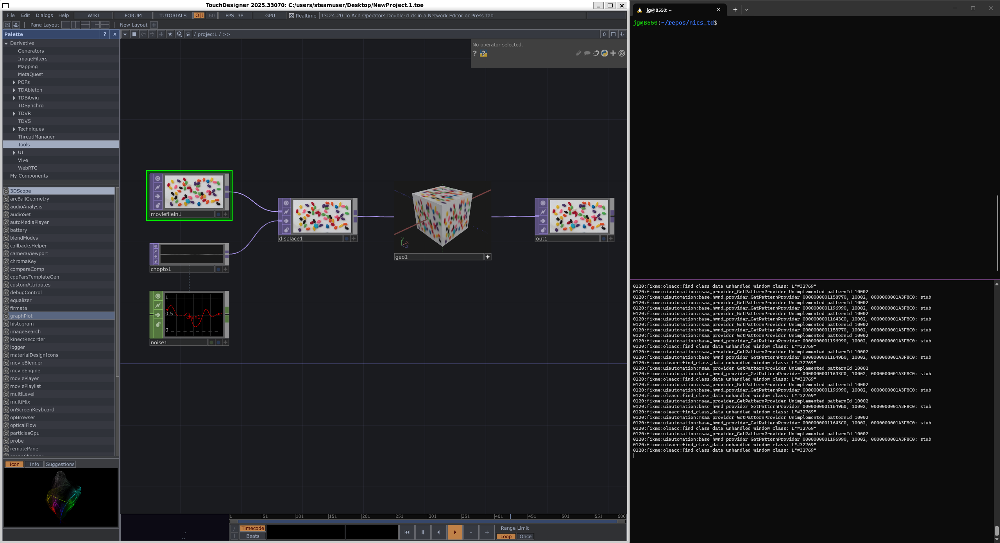

# WSL Setup

## Links
- https://forum.derivative.ca/t/touchdesigner-on-linux-automated-installer-auto-patching-multi-version/978051/3
- https://github.com/iswad-lab/TouchDesigner-Linux

## WSL Distros Tested
- Debian 12

## Dependencies
- GUI apps on WSL. Validate with:
    - (TODO - find test GUI app for WSL, vk-cube or something)
- A [derivative.ca](https://derivative.ca/) account

## Steps
1. Install dependencies not capture by install script
    - `sudo apt install -y file`
    - (TODO - PR into `TouchDesigner-Linux`)
2. Run install script
    - `curl -sSL https://raw.githubusercontent.com/iswad-lab/TouchDesigner-Linux/main/install.sh | bash`
3. (Script) Choose `Install`
4. (Script) Choose latest ToucDesigner version (Tested with `2025.33070`)
5. (Wait for install to finish)
6. Launch with:
    - `launch-touchdesigner.sh`
7. A GUI popup will prompt to install `wine-mono`. Click `Install`
8. Sign in to your [derivative.ca](https://derivative.ca/) account
9. Enjoy!!!

## Screenies

## TODO

- Verify switching text editors

        ▸ Editor preference set in pref.txt: dats.texteditor -> C:\windows\system32\winebrowser.exe
        →
        → Native external editor support is configured!
        →
        →   TouchDesigner will now open Text DATs in your Linux editor
        →   when you press Ctrl+E.
        →
        →   Your default text editor is determined by xdg-mime.
        →   To use a specific editor, run in a terminal:
        →     VSCode:       xdg-mime default code.desktop text/plain
        →     Codium:       xdg-mime default codium.desktop text/plain
        →     Sublime Text: xdg-mime default sublime-text.desktop text/plain
        →     Kate:         xdg-mime default kate.desktop text/plain
        →     Gedit:        xdg-mime default org.gnome.gedit.desktop text/plain
        →     VSCodium:     xdg-mime default vscodium.desktop text/plain
        →
        →   Or set TD_EDITOR in ~/.bashrc:
        →     export TD_EDITOR="code"
        →
        →   The editor preference is stored in TD's pref.txt.
        →   You can also change it manually in TD: Edit > Preferences > DATs
        ▸ Native external editor support configured

- Look into this wine console error:

        019c:fixme:winediag:wined3d_select_feature_level None of the requested D3D feature levels is supported on this GPU with the current shader backend.
