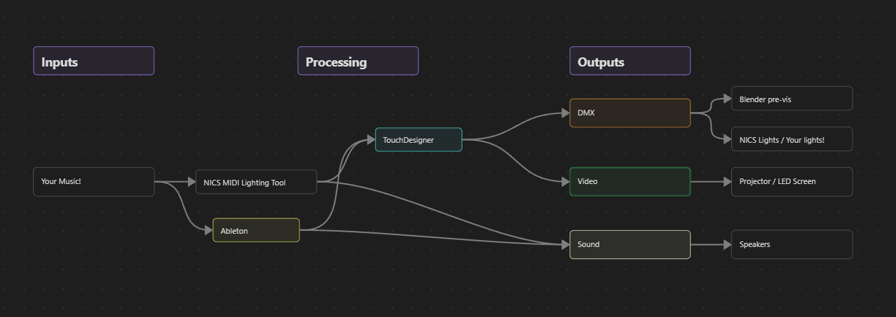

# NICS Performance Stack

## Required Dependencies

### Blender (free) 

#### App Install
Blender can be downloaded [here](https://www.blender.org/download/) (version >=4.2 required)

This addon is require [Blender DMX Addon](https://blenderdmx.eu/) (easy drag and drop install!)

#### Project File
Available here - [Blender project file]( https://drive.google.com/drive/u/3/folders/1sAy4BP1EEYKHOK9oG2kL2qmoLLUDh9_x)

---
### Touch Designer (free)  

#### App Install
TouchDesigner (TD) can de downloaded [here](https://derivative.ca/download) (version >=2025.32820 required)

#### Project File
NICS TD project file is in this repo, which can be downloaded once off as a [zip file](https://github.com/Naarm-Institute-of-Contemporary-Sound/nics_td/archive/refs/heads/main.zip). 
Or if you're a Git enjoyer, it can be cloned with [ssh](git@github.com:Naarm-Institute-of-Contemporary-Sound/nics_td.git) or [https](https://github.com/Naarm-Institute-of-Contemporary-Sound/nics_td.git) (please feel free to push to a branch and make a PR)

The NICS TD project file relies on a few supporting files in the `helper/` directory, please keep the project file with this dir

---
### NICS MIDI Assignment Tool

#### App Install
This free online component can be accessed [here](https://naarm-institute-of-contemporary-sound.github.io/nics_midi_lighting_tool/)
#### Project File
Drag and drop in any audio file! This tool will help you to generate MIDI files that can be played back to Touch Designer and trigger lights

---
### Ableton / a DAW  

The lite version of Ableton will work fine here, it comes bundled with a lot of MIDI controllers for free, or can be purchased online for a few $ from sketchy websites. The full version of Ableton can be purchased from Ableton themselves. Alternatively there is a free trial downloadable [here](https://www.ableton.com/en/trial/) 

Other DAWs capable of outputting MIDI notes and MIDI CC should work fine here, but are not documented yet

